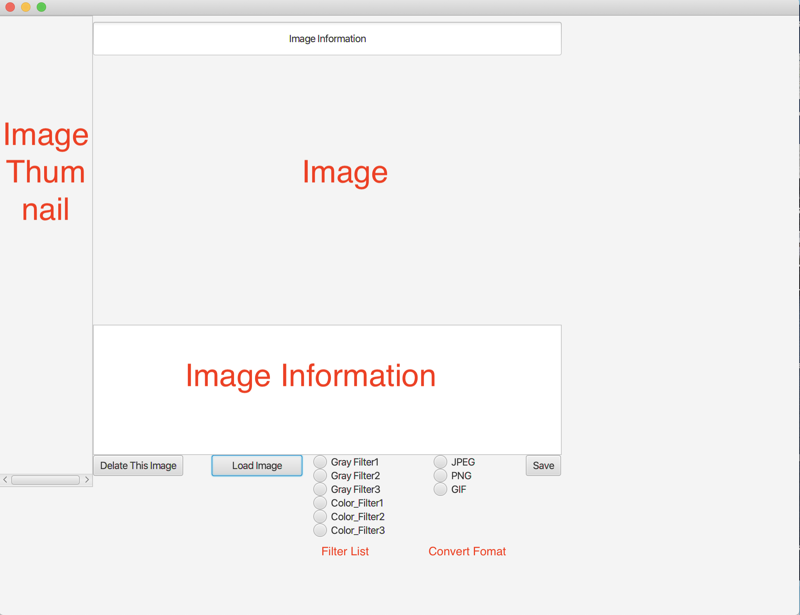

# Simple Image Tool

In this final project, we develop a simple image tool program. In this program, we implements the features as below showing:

1. take one or more image files as input.
2. use Java FX to deveop GUI to allow user to upload image files from computer 
3. show the detail information and thumnails(100 x 100) in the user's interface.
4. implement the function of converting image format and allow users to apply different filters.

## Envirionment 

1. java 12.0.2
2. java fx 13
3. Java fx scene builder 2.0
4. Mac OS 10.15.1
5. Metadata-extractor 2.12.0

## Design Pattern 

* MVC

## Class Diagram

##Screen Shot

* Start

  

* Add first image

  

* Add second image

  

* Add third image

  

* Delate image

  

* Apply filter and convert

  

* Exception 

  

* Before and After

  

